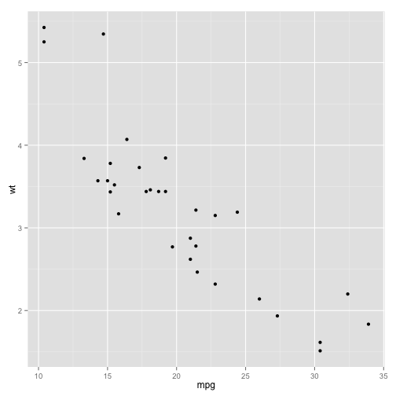

## Introduction

This application is designed to check out the results of motor trend car road tests. The data was extracted from the 1974 Motor Trend US magazine, and comprises fuel consumption and 10 aspects of automobile design and performance for 32 automobiles (1973–74 models). 

From the left panel, one can choose the two variables X and Y, then the plot of the corelation between the two variables appears on the right side. A smoothed condition mean can be added into the plot by check the box of Smooth. Comparisons of different variables can be added through Facet Row and Facet Column panel. 

Here, we also want to show how the vehicle weight effect on the fuel consumption. Based on the linear regression model of weight on mpg, we can predict the mpg (fit value with upper/lower end points) by entering the weight.

Codes (ui.R & server.R) can be found [here](https://github.com/ningkelsey/project)

---
## Plot Section - Input

  

    <form class="well">
      

        <label class="control-label" for="x">X Variables</label>
        

          <select id="x"><option value="mpg" selected>mpg</option>
<option value="cyl">cyl</option>
<option value="disp">disp</option>
<option value="hp">hp</option>
<option value="drat">drat</option>
<option value="wt">wt</option>
<option value="qsec">qsec</option>
<option value="vs">vs</option>
<option value="am">am</option>
<option value="gear">gear</option>
<option value="carb">carb</option></select>
          
        

      

      

        <label class="control-label" for="y">Y Variables</label>
        

          <select id="y"><option value="mpg" selected>mpg</option>
<option value="cyl">cyl</option>
<option value="disp">disp</option>
<option value="hp">hp</option>
<option value="drat">drat</option>
<option value="wt">wt</option>
<option value="qsec">qsec</option>
<option value="vs">vs</option>
<option value="am">am</option>
<option value="gear">gear</option>
<option value="carb">carb</option></select>
          
        

      

      

        

          <label>
            <input id="smooth" type="checkbox"/>
            Smooth
          </label>
        

      

      

        <label class="control-label" for="facet_row">Facet Row</label>
        

          <select id="facet_row"><option value="." selected>None</option>
<option value="mpg">mpg</option>
<option value="cyl">cyl</option>
<option value="disp">disp</option>
<option value="hp">hp</option>
<option value="drat">drat</option>
<option value="wt">wt</option>
<option value="qsec">qsec</option>
<option value="vs">vs</option>
<option value="am">am</option>
<option value="gear">gear</option>
<option value="carb">carb</option></select>
          
        

      

      

        <label class="control-label" for="facet_col">Facet Column</label>
        

          <select id="facet_col"><option value="." selected>None</option>
<option value="mpg">mpg</option>
<option value="cyl">cyl</option>
<option value="disp">disp</option>
<option value="hp">hp</option>
<option value="drat">drat</option>
<option value="wt">wt</option>
<option value="qsec">qsec</option>
<option value="vs">vs</option>
<option value="am">am</option>
<option value="gear">gear</option>
<option value="carb">carb</option></select>
          
        

      

    </form>
  

  

    

  

---

## Plot Section - Plot

 

---
## Impact of Vehicle Weight on Fuel consumption

  

    <form class="well">
      

        <label for="wtinput">Weight, lb</label>
        <input id="wtinput" type="number" class="form-control" value="1000"/>
      

    </form>
  

  

    <h3>Results of Fuel consumption on a given weight</h3>
    <h4>mpg value, Miles/galon</h4>
    <pre id="mpgpred" class="shiny-text-output"></pre>
  

